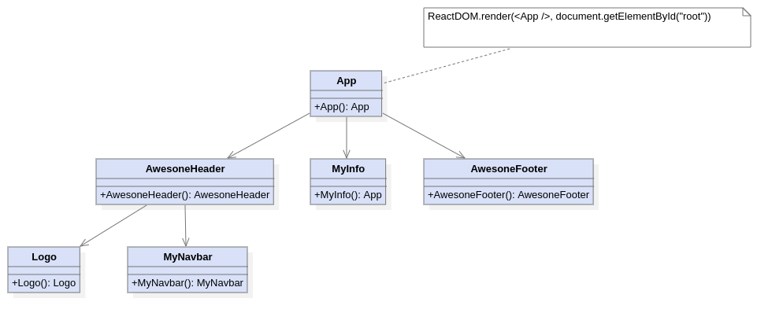

# Parent / Child Components

## Why?

Our applications will become much more complex than having a simple `MyInfo`
component. Eventually we will need to have the ability to nest Components
in other components in a complex hierarchy. This will eventually lead
to nested custom `JSX` elements.

## Example Hierarchy



This is just scratching the surface, component hierarchies can be very complex.

## Example Demo

Run the demo project with the following command

```sh
docker-compose up
```

Changes to the source code will automatically trigger a front-end update
