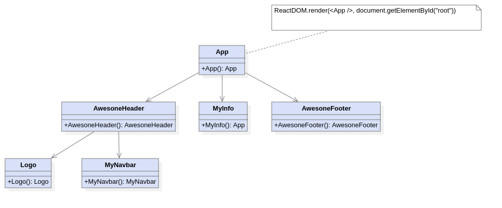

# FreeCodeCamp.org React Courses with Solutions and additional diagrams

Free learning resources based on the FreeCodeCamp.org series of courses.

## Features ✨
- I have included my own diagrams and completed exercises based on the practice problems.
- The diagrams were created using `staruml`. 
- The `staruml` Project files are attached.
- Additional Notes as learning resources
- Docker containers for hassle free setup and isolation of dependencies, etc.
- Vite and TypeScript (`TSX`) for a more up to date experience

## Prerequisites
1) You need to install `docker` the container engine.
2) You also need to install `docker-compose` for simpler usage. 
3) You are ready for launch! 🚀

## Example Component Hierarchy

Have fun learning react ⚛️ !
